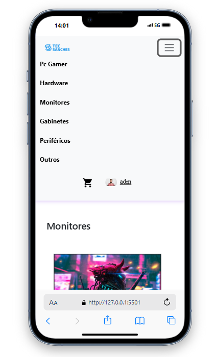
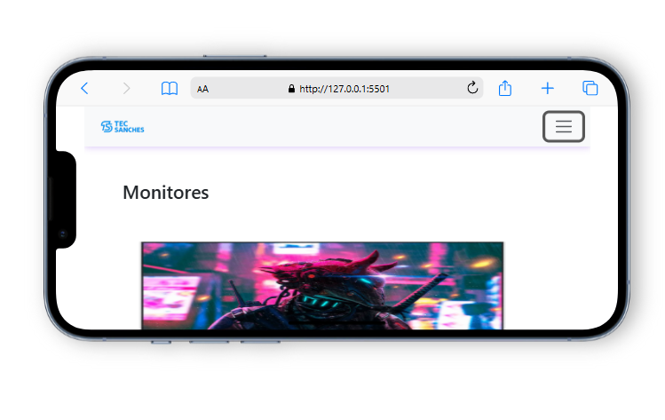
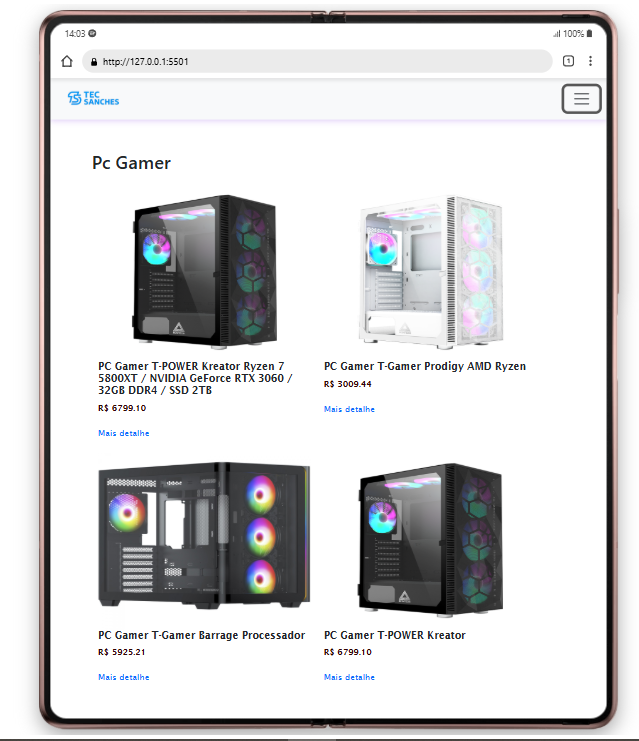
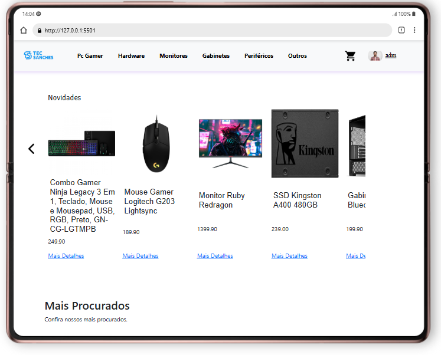

# 🛠️ Projeto Front-End Tec Sabches

Projeto integrador desenvolvido no **Senac Tatuapé**, com foco no **desenvolvimento Front-End** de um site para uma loja de equipamentos de informática.  
Idealizado para simular a estrutura funcional de um comércio moderno, com foco em:

- Cadastro de Usuário
- Produtos
- Vendas
- Pagamentos

## Principais Funcionalidades

### Cliente e Usuário
- Cadastro, atualização e visualização de informações dos usuários do sistema.

### Produto
- Registro de produtos com dados como:
  - Nome, marca, categoria, código de barras, fabricante
  - Preço, garantia e descrição

### Venda
- Registro de transações comerciais entre clientes e loja
- Armazena dados de entrega e valor total da compra

### ItemVenda
- Detalhamento dos produtos por venda
- Inclui quantidade, preço unitário e descontos aplicáveis

### Pagamento
- Associado às vendas, com:
  - Tipo de pagamento, valor, status e número de parcelas

## Ambiente de Desenvolvimento

O Front-End foi desenvolvido com:

- **Visual Studio Code**
- Tecnologias como HTML, CSS e JavaScript
- Estrutura modular e organizada por páginas e componentes

## Responsivo
 | 
 | 

# Autores
* Allan Victor – Front-End

* Fernanda Batista – Back-End, Front-End e Banco de Dados

* Ryan – Front-End

* Thiago Sanches – Back-End, Front-End, Banco de Dados e Documentação

## Observações Finais

Este projeto é **educacional**, feito como parte do curso técnico e pode servir como base para implementações futuras, como a integração com APIs ou banco de dados real.

